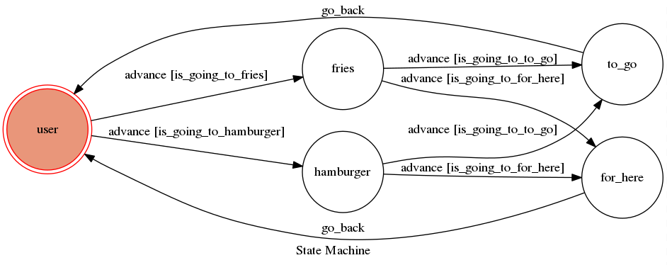

# chatbot

## Finite State Machine

## Usage
The initial state is set to `user`.

Every time `user` state is triggered to `advance` to another state, it will `go_back` to `user` state after for here or to go.

* user
	* Input-1: "hamburger"
		* Reply: "for here or to go"
	* Input-2: "for here"
		* Reply: "ok,for here"
		* bo back to user
	* Input-2: "to go"
		* Reply: "ok,to go"
		* bo back to user
			
	* Input-1: "fries"
		* Reply: "for here or to go"
	* Input-2: "for here"
		* Reply: "ok,for here"
		* bo back to user
	* Input-2: "to go"
		* Reply: "ok,to go"
		* bo back to user
